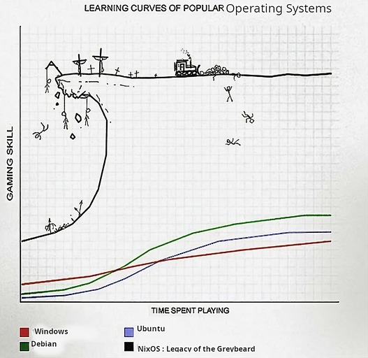

<div align="center">
  
</div>

# About

My [nix](https://nixos.org/learn.html) configuration for [NixOS](https://nixos.org) based systems.

[](https://builtwithnix.org)

> [!NOTE]  
> This repository is not meant to be used as a whole, but rather as a reference for my own configuration. I do not recommend using it as is, as it is not meant to be used by anyone else. I do not provide any support for this repository. If you want to use it, you are on your own.
>
> I'll eventually switch to [flakes](https://nixos.wiki/wiki/Flakes) configuration.

## Formatter and Linter

[alejandra](https://github.com/kamadorueda/alejandra) is used to format all the nix files. nixfmt and nixpkgs-fmt both advertise ugly and confusing diffs.

Alejandra is based on the original style of Nixpkgs, and then they applied the feedback from developers with extensive experience using Nix at scale, producing a very well-grounded style guide.

[statix](https://github.com/nerdypepper/statix) is used to capture and fix anti-patterns in all the nix files.

[deadnix](https://github.com/astro/deadnix) is used to scan nix files for dead code and automatically remove unused code.

## Channels

```nix
nixos https://nixos.org/channels/nixos-unstable
home-manager https://github.com/nix-community/home-manager/archive/master.tar.gz
nur https://github.com/nix-community/NUR/archive/master.tar.gz
emacs https://github.com/nix-community/emacs-overlay/archive/master.tar.gz
haskell https://github.com/input-output-hk/haskell.nix/archive/master.tar.gz
mozilla https://github.com/mozilla/nixpkgs-mozilla/archive/master.tar.gz
ragenix https://github.com/yaxitech/ragenix/archive/main.tar.gz
musnix https://github.com/musnix/musnix/archive/master.tar.gz
```

## Resources

### Official Nix/NixOS Search

- [Packages](https://search.nixos.org/packages)
- [Options](https://search.nixos.org/options)
- [Flakes](https://search.nixos.org/flakes)

### Packages

- [NixHub](https://www.nixhub.io) - Search over 400K granular versions of nix packages.
- [Nix package versions](https://lazamar.co.uk/nix-versions) - Find all versions of a package that were available in a channel and the revision you can download it from.
- [NUR (Nix User Repository)](https://nur.nix-community.org) - A community-driven meta repository for Nix packages.

### Home Manager

- [Option Search](https://home-manager-options.extranix.com)
- [Configuration Options Appendix](https://nix-community.github.io/home-manager/options.xhtml)

### Flakes

- [FlakeHub](https://flakehub.com) - Find, install, and publish Nix Flakes.

### Configuration

- [MyNixOS](https://mynixos.com) - Build and share reproducible software environments with Nix and NixOS.

### Functions

- [Noogle](https://noogle.dev) - Nix API search engine allowing to search functions based on their types and other attributes.
- [teu5us.github.io/nix-lib](https://teu5us.github.io/nix-lib.html) - Nix (builtins) & Nixpkgs (lib) Functions docs by teu5us.

### Channel

- [Channel History](https://channels.nix.gsc.io/) - Get historical git commits for Nix channels.
- [Nix Channel Status](https://status.nixos.org) - Get the age and current git commit of each Nix channel.

### Community/User Packages/Flakes/Overlays

- [NUR](https://github.com/nix-community/NUR/) - User contributed nix packages.
- [Chaotic-Nyx](https://github.com/chaotic-cx/nyx) - Daily bumped bleeding edge packages that aren't yet in Nixpkgs. Created by the makers of Chaotic-AUR.
- [Nix-Gaming](https://github.com/fufexan/nix-gaming) - Gaming related stuff for Nix and NixOS.
- [Nixified AI](https://nixified.ai) -  A Nix flake for many AI projects.
- [nixpkgs-mozilla](https://github.com/mozilla/nixpkgs-mozilla) -  Official Mozilla overlay for Nixpkgs.
- [nixpkgs-wayland](https://github.com/nix-community/nixpkgs-wayland) - Bleeding-edge Wayland packages.

### Misc

- [Nix/NixOS Configuration Collection](https://nixos.wiki/wiki/Configuration_Collection) - Alphabetically sorted lists of different configuration repositories, by the community members of NixOS
- [Jovian NixOS](https://jovian-experiments.github.io/Jovian-NixOS/index.html) - A set of packages and configurations for running NixOS on the Steam Deck.
- [Nixpkgs Pull Request Tracker](https://nixpk.gs/pr-tracker.html) - A tracker for whether a PR has made it into a channel yet.
- [Nix Review Tools Reports](https://malob.github.io/nix-review-tools-reports/) - Reports showing problematic dependencies (dependencies causing the most failed builds) for major Hydra jobsets.

### Notable Mentions

[home-manager](https://github.com/nix-community/home-manager) - A system for managing a user environment using the nix. It allows declarative configuration of user specific (non-global) packages and dotfiles.

[NUR](https://github.com/nix-community/NUR) - User contributed nix packages. In contrast to Nixpkgs, packages are built from source and are not reviewed by any Nixpkgs member.

[chaotic nyx](https://github.com/chaotic-cx/nyx) - Nix flake for too much bleeding-edge and unreleased packages. And experimental modules.

[alejandra](https://github.com/kamadorueda/alejandra) - The Uncompromising Nix Code Formatter. It applies the feedback of developers who have used Nix at scale for several years, producing a very well-grounded style guide.

[statix](https://github.com/nerdypepper/statix) - lints and suggestions for the nix. Able to highlight anti-patterns in Nix code and fix them.

[deadnix](https://github.com/astro/deadnix) -  Scan Nix files for dead code. Able to automatically remove unused code.

[trustix](https://github.com/nix-community/trustix) - Tool that compares build outputs for a given build input across a group of independent providers to establish trust in software binaries.

[nix-gaming](https://github.com/fufexan/nix-gaming) - Gaming related stuff for Nix and NixOS.

[musnix](https://github.com/musnix/musnix) - Real-time audio in NixOS.

[schizofox](https://github.com/schizofox/schizofox) - Hardened Firefox flake for the delusional and the schizophrenics. Can be used as reference.

[nixbsd](https://github.com/nixos-bsd/nixbsd) - An unofficial NixOS fork with a FreeBSD kernel.

[RedNixOS](https://github.com/redcode-labs/RedNixOS) - NixOS-based distro for cybersecurity enthusiasts.

[Athena-OS](https://github.com/Athena-OS) - NixOS-based distribution intended to build a new concept of pentesting operating system.

[SnowflakeOS](https://snowflakeos.org)

[flox](https://github.com/flox/flox) - A virtual environment and package manager all in one. Installs packages from nixpkgs.

[nix-topology](https://github.com/oddlama/nix-topology) - Automatically generate infrastructure and network diagrams as SVGs directly from your NixOS configurations.

[agenix](https://github.com/ryantm/agenix) - A small and convenient nix library for securely managing and deploying secrets using common public-private SSH key pairs. Age-encrypted secrets for NixOS and Home manager.

[ragenix](https://github.com/yaxitech/ragenix) - Provides age-encrypted secrets for NixOS systems which live in the Nix store and are decrypted on system activation. A drop-in replacement for agenix.

[icicle](https://github.com/snowfallorg/icicle) -  A gtk4/libadwaita installer for NixOS based distributions.

[nix-software-center](https://github.com/snowfallorg/nix-software-center) -  A simple gtk4/libadwaita software center to easily install and manage nix packages.

[nixos-conf-editor](https://github.com/snowfallorg/nixos-conf-editor) -  A libadwaita/gtk4 app for editing NixOS configurations.

[styx](https://github.com/dnr/styx) - An alternate binary substitution mechanism for nix.

[vulnix](https://github.com/nix-community/vulnix) - A utility that validates a Nix store for any packages that are reachable from live paths and likely to be affected by vulnerabilities listed in the NVD.

[nix-sandwich](https://github.com/dnr/nix-sandwich) - Implements differential compression for downloading from a nix binary cache.

[lanzaboote](https://github.com/nix-community/lanzaboote) - Tooling for UEFI Secure Boot on NixOS.

[sops-nix](https://github.com/Mic92/sops-nix) - Atomic, declarative, and reproducible secret provisioning for NixOS based on sops.

[disko](https://github.com/nix-community/disko) - Declarative disk partitioning and formatting using nix.

[nix-colors](https://github.com/Misterio77/nix-colors) - Modules and schemes to make theming with nix awesome.

[stylix](https://github.com/danth/stylix) - System-wide colorscheming and typography for nixos.

## Abandon Hope, All Ye Who Enter Here


