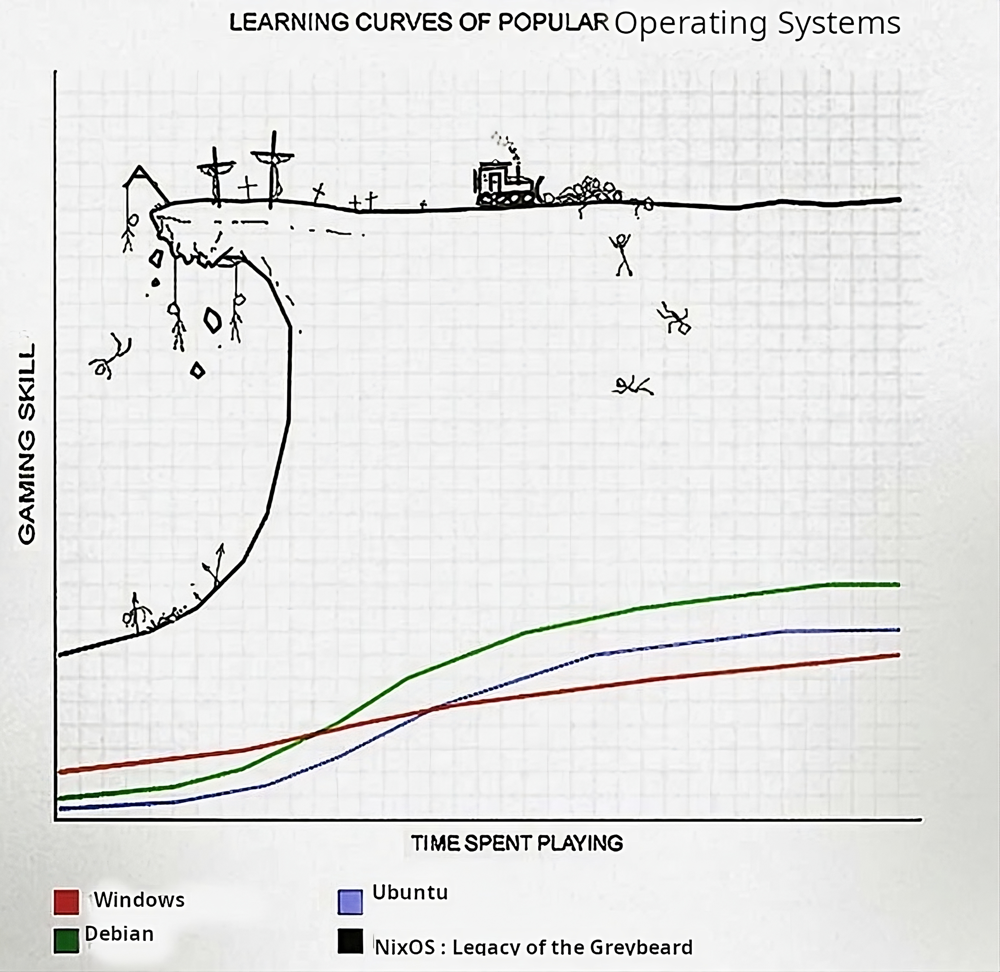

<div align="center">
  
</div>

# About

My [nix](https://nixos.org/learn.html) configuration for [NixOS](https://nixos.org) based systems.

[](https://builtwithnix.org)

> [!NOTE]  
> This repository is not meant to be used as a whole, but rather as a reference for my own configuration. I do not recommend using it as is, as it is not meant to be used by anyone else. I do not provide any support for this repository. If you want to use it, you are on your own.
>
> I'll eventually switch to [flakes](https://nixos.wiki/wiki/Flakes) configuration.

## Channels

```nix
nixos https://nixos.org/channels/nixos-unstable
home-manager https://github.com/nix-community/home-manager/archive/master.tar.gz
nur https://github.com/nix-community/NUR/archive/master.tar.gz
emacs https://github.com/nix-community/emacs-overlay/archive/master.tar.gz
haskell https://github.com/input-output-hk/haskell.nix/archive/master.tar.gz
mozilla https://github.com/mozilla/nixpkgs-mozilla/archive/master.tar.gz
ragenix https://github.com/yaxitech/ragenix/archive/main.tar.gz
```

## Options and Packages

### Packages

1. [Nix](https://search.nixos.org/packages)
2. [NUR](https://nur.nix-community.org)

### Options

1. [Nix](https://search.nixos.org/options)
2. [Home-Manager](https://mipmip.github.io/home-manager-option-search/)

### Abandon Hope, All Ye Who Enter Here


