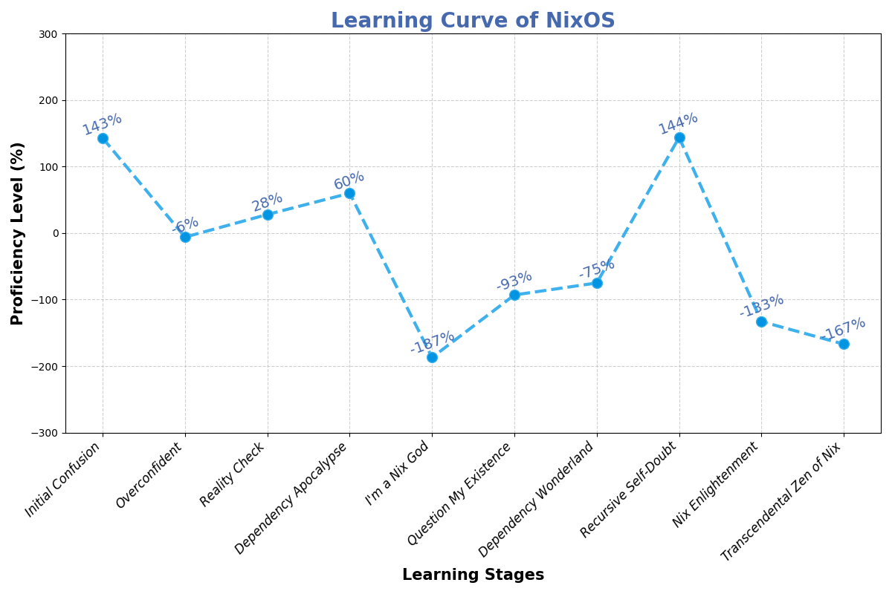

<div align="center">
  
</div>

## About

My [nix](https://nixos.org/learn.html) configuration for [NixOS](https://nixos.org) based systems.

## Channels

```nix
home-manager https://github.com/nix-community/home-manager/archive/master.tar.gz
nixos https://nixos.org/channels/nixos-unstable
nur https://github.com/nix-community/NUR/archive/master.tar.gz
```

## Note

This repository is not meant to be used as a whole, but rather as a reference for my own configuration. I do not recommend using it as is, as it is not meant to be used by anyone else. I do not provide any support for this repository. If you want to use it, you are on your own.

I'll eventually switch to [flakes](https://nixos.wiki/wiki/Flakes) configuration.

### Abandon Hope, All Ye Who Enter Here

